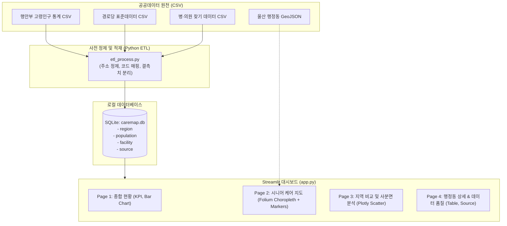
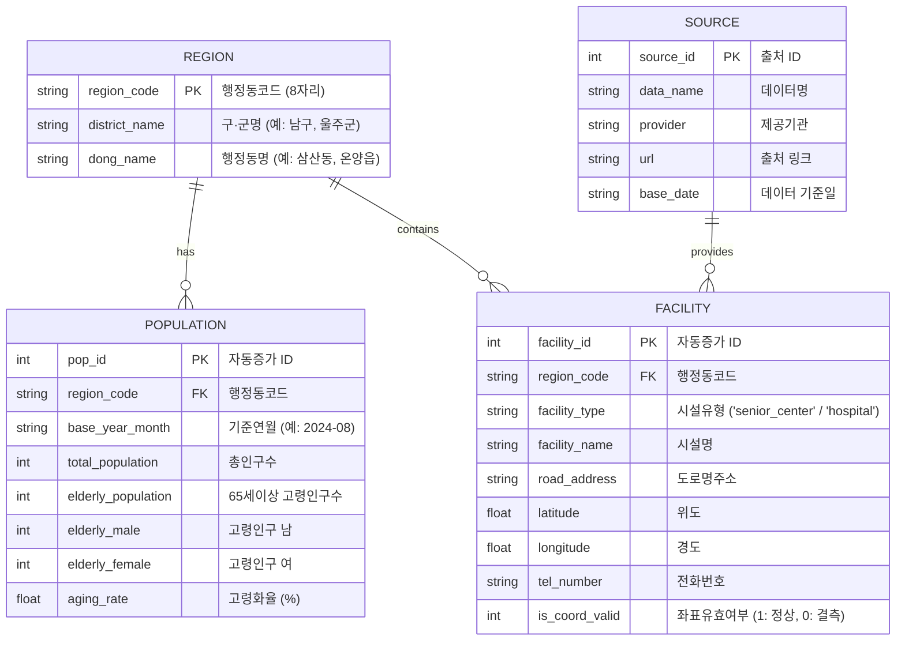

# [구현 계획서] 울산 시니어 케어맵 대시보드 구축

본 문서는 공공데이터를 활용하여 울산광역시의 고령인구 분포와 의료·복지 인프라 분포를 시각화하는 **「울산 시니어 케어맵」 Streamlit 대시보드 프로젝트**의 요구사항 정의서, 시스템 구조도 및 5일간의 상세 구현 계획서입니다.

---

## 1. 프로젝트 정의 및 핵심 목표

### 핵심 질문
> **"울산의 고령인구 분포와 의료·복지 인프라 분포는 지역별로 어떤 차이를 보이는가?"**

### 프로젝트 목적
- 울산광역시 5개 구·군 및 56개 읍·면·동의 고령화율과 의료·여가 복지시설(병·의원, 경로당) 위치 데이터를 결합하여 지역별 격차를 탐색하는 대시보드를 구축합니다.
- 임의의 주관적 점수(취약성 지수) 대신 **원천 공공데이터와 표준화된 객관적 비율 지표(고령인구 1천명당 시설 수)**를 제공하여 신뢰성을 확보합니다.
- 파이썬 초보자도 이해하기 쉬운 **단순하고 명확한 코드 구조**와 **SQLite 로컬 데이터베이스 기반 분리 설계**를 적용합니다.

---

## 2. 요구사항 정의서 (Requirement Specification)

### 2.1 기능 요구사항 (Functional Requirements)

| 요구사항 ID | 분류 | 요구사항 명칭 | 상세 설명 |
| :--- | :--- | :--- | :--- |
| **REQ-F01** | 데이터 수집/정제 | 공공데이터 CSV 수집 및 정제 | 행안부 고령인구통계, 공공데이터포털 경로당 표준데이터, 전국 병·의원 데이터를 울산 지역으로 필터링 및 주소 정규화 |
| **REQ-F02** | 데이터베이스 | SQLite DB 적재 (ETL) | 정제된 데이터를 `caremap.db`의 4개 테이블(`region`, `population`, `facility`, `source`)에 적재 |
| **REQ-F03** | 지도 데이터 | 울산 행정동 GeoJSON 연계 | WGS84 좌표계 기반 울산 행정구역 경계 GeoJSON과 행정동 코드를 매핑 |
| **REQ-F04** | Page 1 | 울산 고령화 및 인프라 종합 현황 | 기준월/구·군 필터, KPI 5개(총인구, 고령인구, 고령화율, 병의원수, 경로당수), 구·군별 비교 막대그래프 |
| **REQ-F05** | Page 2 | 시니어 케어 인터랙티브 지도 | Folium 기반 행정동 고령화율 Choropleth + 병의원/경로당 마커 클러스터 및 레이어 토글(on/off) |
| **REQ-F06** | Page 3 | 지역 비교 및 사분면 탐색 | Plotly 산점도(x: 고령화율, y: 1천명당 시설수)로 인프라 상대적 부족 지역 탐색, 두 행정동 1:1 비교 카드 |
| **REQ-F07** | Page 4 | 행정동 상세 프로필 & 데이터 품질 | 특정 행정동 선택 시 시설 세부 목록 테이블, 좌표 결측 현황, 공공데이터 원천 출처 및 기준일, 해석상 한계 명시 |

### 2.2 비기능 요구사항 (Non-Functional Requirements)

| 요구사항 ID | 분류 | 상세 기준 |
| :--- | :--- | :--- |
| **REQ-NF01** | 코드 단순성 및 가독성 | 초보자가 쉽게 읽을 수 있도록 함수당 1가지 기능만 수행, 직관적인 영어 변수/함수명 사용 |
| **REQ-NF02** | 성능 및 안정성 | API 실시간 호출 대신 SQLite 로컬 캐시 조회 방식 채택, Streamlit `@st.cache_data`로 화면 전환 시 0.2초 이내 반응 |
| **REQ-NF03** | 데이터 신뢰성 | 지표 산출 계산식 및 공공데이터 기준일자를 화면마다 투명하게 공개 |
| **REQ-NF04** | 데이터 품질 관리 | 위·경도 좌표 결측치는 지도에서 제외하되 건수를 데이터 품질표에 정확히 집계하여 표시 |

---

## 3. 시스템 아키텍처 및 데이터 흐름



---

## 4. 데이터베이스 및 ERD 설계

SQLite 파일(`database/caremap.db`)을 사용하며, 초보자도 이해하기 쉬운 4개 핵심 테이블로 구성합니다.



---

## 5. 4개 페이지 상세 화면 설계

```
┌────────────────────────────────────────────────────────────────────────┐
│                        울산 시니어 케어맵                              │
├────────────────────────────────────────────────────────────────────────┤
│ 사이드바 (Sidebar):                                                    │
│  - 페이지 선택 (1.종합현황 / 2.시니어지도 / 3.지역비교 / 4.상세및품질) │
│  - 구·군 필터 (전체 / 중구 / 남구 / 동구 / 북구 / 울주군)              │
│  - 데이터 기준월 선택                                                  │
└────────────────────────────────────────────────────────────────────────┘
```

### [Page 1] 울산 고령화 및 인프라 종합 현황 (Overview)
- **상단 KPI 카드 (5개)**: 총인구 / 고령인구 / 평균 고령화율 / 병·의원 수 / 경로당 수
- **중앙 차트 1**: 구·군별 고령인구 수 vs 고령화율 비교 막대그래프 (Plotly)
- **중앙 차트 2**: 고령화율 상위 10개 행정동 순위 막대그래프
- **하단 요약**: 구·군별 고령인구 1천명당 시설 수 요약 테이블

### [Page 2] 시니어 케어 지도 (Senior Care Map)
- **지도 본체 (Folium)**:
  - **배경 폴리곤(Choropleth)**: 행정동별 고령화율을 색상 단계(색약 친화적 팔레트)로 시각화
  - **마커 레이어 (LayerControl 토글)**:
    - 🔵 병·의원 레이어 (마커 클릭 시 병원명, 진료과, 주소 팝업)
    - 🟢 경로당 레이어 (마커 클러스터 적용으로 쾌적한 렌더링)
- **우측/하단 카드**: 사용자가 지도를 확대/탐색할 때 참고할 범례 및 통계 요약

### [Page 3] 지역 간 비교 및 사분면 분석 (Region Comparison)
- **핵심 시각화 (Plotly Scatter Chart)**:
  - X축: 행정동 고령화율(%)
  - Y축: 고령인구 1천명당 시설 수 (병·의원 또는 경로당 선택)
  - 4분면 기준선: 울산광역시 전체 중앙값(Median)
  - **탐색 목적**: "고령화율은 높지만 인구 대비 시설 수가 적은 행정동" 직관적 식별
- **행정동 1:1 맞비교 섹션**:
  - 두 개의 행정동(예: 삼산동 vs 온양읍)을 드롭다운으로 선택하여 인구, 시설수, 지표를 나란히 비교

### [Page 4] 행정동 상세 정보 & 데이터 품질 (Detail & Data Quality)
- **행정동 상세 프로필**:
  - 선택한 행정동의 전체 시설 목록 테이블 (검색 및 정렬 지원, CSV 다운로드 버튼)
- **데이터 품질 모니터링 카드**:
  - 정상 매핑 건수 vs 주소/좌표 결측 건수 표기
- **공공데이터 출처 및 라이선스**:
  - 행안부, 공공데이터포털 원천 링크 및 데이터 기준일자 표기
- **해석상 주의사항 알림 (Callout)**:
  > [!NOTE]
  > 본 대시보드의 시설 수는 실제 서비스 용량(병상 수, 면적 등) 및 대중교통 접근성을 반영하지 않는 기초 탐색용 지표입니다.

---

## 6. 추천 폴더 및 파일 구조

초보자 입장에서 파일별 역할이 한눈에 들어오도록 모듈을 분리합니다.

```text
c:\Projects\2팀프로젝트/
├── data/
│   ├── raw/                      # 다운로드한 원본 CSV 파일 저장소
│   │   ├── ulsan_population.csv
│   │   ├── ulsan_senior_center.csv
│   │   └── ulsan_hospital.csv
│   └── ulsan_dong.geojson        # 울산 행정동 경계 지도 (WGS84)
├── database/
│   ├── caremap.db                # SQLite 데이터베이스 파일
│   └── db_manager.py             # DB 생성 및 SQL 조회 전용 헬퍼 함수
├── scripts/
│   ├── clean_population.py       # 인구 CSV 정제 함수
│   ├── clean_facility.py         # 시설 CSV 정제 함수
│   └── run_etl.py                # 전체 정제 및 DB 적재 실행 스크립트
├── pages/
│   ├── 1_종합현황.py              # Overview 페이지
│   ├── 2_시니어지도.py           # Folium 지도 페이지
│   ├── 3_지역비교.py              # 산점도 및 비교 페이지
│   └── 4_상세및품질.py           # 행정동 상세 및 데이터 출처 페이지
├── app.py                        # Streamlit 진입점 및 홈 화면
├── requirements.txt              # 설치 라이브러리 목록
└── README.md                     # 프로젝트 설명서
```

---

## 7. 5일 작업 계획서 (WBS)

| 일자 | 단계 | 핵심 작업 내용 | 완료 산출물 (완료 기준) |
| :--- | :--- | :--- | :--- |
| **Day 1<br>(9/28, 오늘)** | **환경 구성 & 데이터 확보** | 1. 가상환경 및 라이브러리 설정 (`requirements.txt`)<br>2. 공공데이터포털 CSV 다운로드 및 `data/raw/` 배치<br>3. 울산 행정동 GeoJSON 확보<br>4. 폴더 구조 생성 및 Git 초기화 | - 기본 프로젝트 구조 생성<br>- 원천 데이터 파일 3개 및 GeoJSON 준비 |
| **Day 2<br>(9/29)** | **데이터 정제 & DB 구축 (ETL)** | 1. `db_manager.py` 테이블 스키마 생성<br>2. 주소 정규화(구·군 및 행정동 추출) 함수 작성<br>3. 결측치 플래그 처리 및 SQLite 적재 스크립트 실행<br>4. SQL 쿼리로 적재 데이터 정합성 검증 | - `caremap.db` 생성 완료<br>- 인구 및 시설 테이블 조인 쿼리 정상 동작 |
| **Day 3<br>(9/30)** | **기본 UI & 대시보드 1, 2페이지** | 1. `app.py` 공통 사이드바 및 필터 구현<br>2. `1_종합현황.py`: KPI 카드 5개 + 구군별 Plotly 막대그래프<br>3. `2_시니어지도.py`: Folium 기반 행정동 Choropleth + 병의원/경로당 마커 클러스터 | - 1, 2페이지 정상 렌더링<br>- 사이드바 구·군 필터 변경 시 차트 연동 확인 |
| **Day 4<br>(10/01)** | **고급 분석 3, 4페이지** | 1. `3_지역비교.py`: 고령화율 vs 시설수 4분면 산점도 및 1:1 비교<br>2. `4_상세및품질.py`: 행정동 시설 테이블, CSV 다운로드, 데이터 품질 카드, 출처 링크 | - 3, 4페이지 완성<br>- 4개 페이지 전체 네비게이션 연결 완료 |
| **Day 5<br>(10/02)** | **검증, 최적화 & 최종 정리** | 1. 수치 및 비율 계산식 검증 (인구 1천명당 시설수)<br>2. UI 디자인 다듬기 (색약 친화 팔레트, 툴팁 설명)<br>3. GitHub 커밋 및 README.md(데이터 출처, 스크린샷, 실행법) 작성 | - 대시보드 완성본<br>- 최종 Git 커밋 및 발표 자료 준비 완료 |

---

## 8. 초보자를 위한 파이썬 코딩 원칙

1. **단순하고 읽기 쉬운 코드**:
   - 복잡한 컴프리헨션이나 중첩 람다(lambda) 대신, 알기 쉬운 `for`문과 명시적 함수를 사용합니다.
2. **함수당 한 가지 기능**:
   - 예: `load_population_data()`는 인구 데이터만 로드, `calculate_aging_rate()`는 고령화율만 계산.
3. **명확한 영어 네이밍**:
   - 변수: `senior_count`, `total_pop`, `hospital_list`
   - 함수: `get_district_summary()`, `draw_choropleth_map()`
4. **철저한 예외 방지**:
   - 0으로 나누기 오류 방지: `elderly_pop / total_pop if total_pop > 0 else 0`
   - 위·경도 결측치는 삭제하지 않고 `is_coord_valid = 0`으로 보존하여 품질 화면에서 표기.

---

## 9. 검증 및 테스트 계획

### 9.1 자동화 스크립트 검증
- **ETL 무결성 검증 (`verify_etl.py`)**:
  - 행정동 코드가 비어 있는 행이 있는지 확인
  - 위도(35.3 ~ 35.7), 경도(129.0 ~ 129.5) 울산 범위 밖의 이상치 탐지
  - 인구수 및 시설수가 음수인 데이터 검출

### 9.2 수동 UI 검증
- 사이드바에서 특정 구(예: "남구")를 선택했을 때 4개 페이지의 모든 차트와 지도가 남구 데이터로 정확히 필터링되는지 확인
- 지도 마커를 클릭했을 때 팝업 창에 시설 이름과 주소가 깨짐 없이 한글로 잘 표시되는지 확인
- 산점도에서 행정동 포인트에 마우스를 올렸을 때 정확한 수치 툴팁이 뜨는지 확인

---

## User Review Required
> [!IMPORTANT]
> 1. 원천 데이터로 사용할 **공공데이터 파일(인구 통계 CSV, 경로당 표준데이터 CSV, 병·의원 데이터 CSV)**과 **울산 행정동 GeoJSON**을 현재 보유하고 계신가요? 아니면 1일차 작업으로 다운로드 가이드부터 함께 진행할까요?
> 2. 위 5일 WBS 및 4개 페이지 구조(종합현황, 시니어지도, 지역비교, 상세/품질)에 동의하시는지 확인 부탁드립니다. 승인해 주시면 1일차 작업부터 순서대로 안전하게 시작하겠습니다.
